# MediBot

Offline AI Health Assistant (PWA)

MediBot is a fully offline AI-powered health assistant built as a Progressive Web App. It runs entirely in the browser with no backend, no API, and no internet required after the first load.

## Features

* Offline AI chatbot with rule-based intelligence
* Symptom detection with causes, remedies, and risk levels
* Emergency condition detection
* Built-in health tools (breathing, stress, hydration, sleep)
* Local storage for chat history and user data
* Installable PWA (mobile and desktop)

## Tech Stack

* HTML, CSS, JavaScript
* Service Worker (offline support)
* Web App Manifest (PWA)
* Browser APIs (localStorage, Canvas, Vibration)

## Deployment

Deploy easily using Netlify or any static hosting.

## Note

MediBot is for informational purposes only and not a replacement for professional medical advice.

## Author

Gokulraj

---

